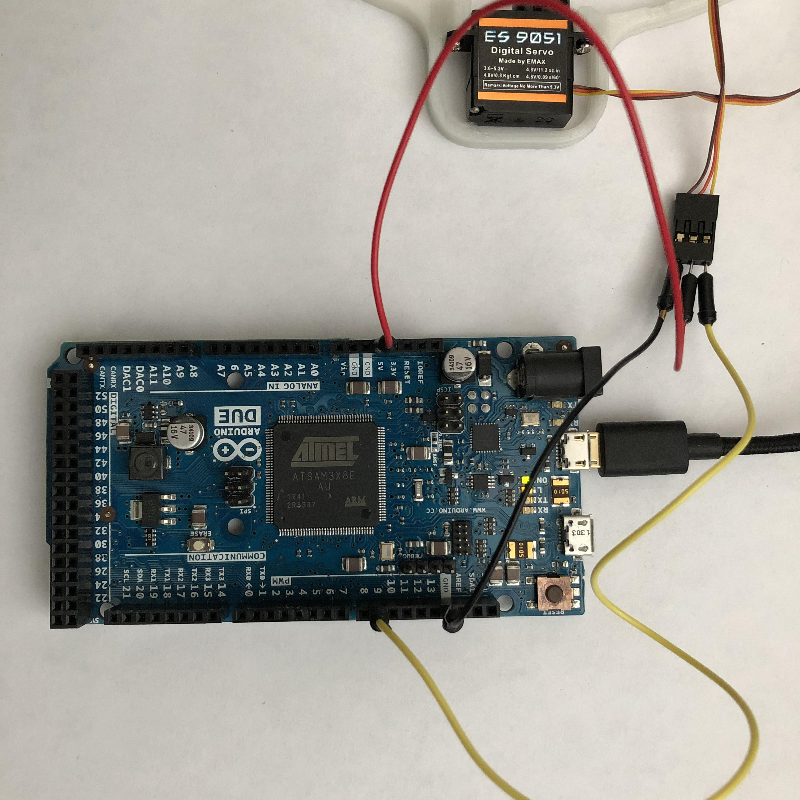

# Ball drone assembly notes

Based on [this](https://hackaday.io/project/175512-the-ball-drone-project-mk-ii) project with very slight modifications.

## Parts

**Note**: you only need **one** receiver from the list below, depending on your transmitter. See details [here](https://www.rcgroups.com/forums/showthread.php?2301242-The-Beginners-Guide-to-RC-Protocols) or [here](http://openpanzer.org/wiki/doku.php?id=wiki:tcb:tcbinstall:rx:rxselection).

| Name | Comments | Price $ |
| ---- | -------- | ----- |
| 3D printed [parts](./3d_printing) | Had to modify a bit (rotate / slice) to be able to print on Prusa i3 MK2 | - |
| Flight controller [Mamba MK2 F405](https://www.diatone.us/collections/basic-fc/products/mamba-f405-flight-controller-mk2) | [Banggood](https://www.banggood.com/search/1345007.html) - was out of stock | 27.55 |
| RC receiver [Flysky FS-A8S](https://www.banggood.com/search/1092861.html) | For FlySky (AFHDS 2A) transmitters |  11.99 |
| RC receiver [FrSky R-XSR](https://www.amazon.com/FrSky-R-XSR-Redundancy-Telemetry-Receiver/dp/B074QHJRBC) | For FrSky (ACCST) transmitters (e.g. Taranis) |  25.59 |
| ESC [T-motor F35A 3-6S BLHeli_32](https://www.banggood.com/search/1221106.html) | Alternative: [DYS BL30A Mini 30A BLHeli OPTO](https://www.banggood.com/search/975799.html)  | 22 |
| Motors [Racerstar Racing Edition 2306](https://www.banggood.com/search/1149532.html) | - | 9.60 |
| Propeller [FCMODEL 6045 6 Inch 3-Blade](https://www.banggood.com/search/1006366.html) | - | 3.49 |
| Servos [4X Emax ES9051 Digital Mini Servo](https://www.banggood.com/search/1039587.html) | - | 16.99 |
| Battery [Tattu 11.1V 1300mAh 75C 3S](https://www.amazon.com/1300mAh-Battery-Airplane-Shredder-HOVERSHIP/dp/B013I9SYC0/) | - | 18.99 |
| M3 [hardware kit](https://www.amazon.com/SZHKM-Screws-Washer-Varied-Assortment/dp/B076J5RGKS/) | Nylon instead of metal | 14.99 |
| Servo [extension cables](https://www.amazon.com/gp/product/B00MIQRN2C) | Needed as an extension to connect servos to FC | 5.99 |
| XT60 [male connector](https://www.amazon.com/MCIGICM-Female-Bullet-Connectors-Battery/dp/B07DVDKL42/) | - | |

## Assembly

Follow the instructions on [Hack-A-Day](https://hackaday.io/project/175512-the-ball-drone-project-mk-ii) or [Make Magazine, Vol. 76](https://makezine.com/).

### Servo calibration

To center the servos you can use provided [Arduino sketch](./sketches/servo_calib.ino).
Here is the respective wiring:

<a href="./images/arduino_servo_wiring.jpg"></a>

### RC Receiver binding

Binding RC transmitter and receiver can sometimes be tricky. Most importantly, make sure that protocols, AFHDS or ACCST, of transmitter and receiver match.

In my case, I have [Taranis X9D+](https://www.frsky-rc.com/product/taranis-x9d-plus-2/) transmitter and [FrSky R-XSR](https://www.frsky-rc.com/r-xsr/) receiver. My firmware configuration is:
* [OpenTX 2.3.11](https://www.open-tx.org/2021/01/08/opentx-2.3.11). How to [update](https://oscarliang.com/flash-opentx-firmware-taranis/).
* Pre 2.x version of firmware both in Taranis XJT internal module and R-XSR receiver (ACCST D16).
    * It is important that these versions match, otherwise transmitter and receiver will not bind.
    * [How to update receiver firmware](https://www.frsky-rc.com/how-to-use-the-transmitter-to-flash-the-firmware-of-the-x8r-receiver/), or [another tutorial](https://oscarliang.com/flash-frsky-rx-firmware/).
    * [XJT firmware](https://www.frsky-rc.com/xjt/)
    * If you decide to use version 2.x, then corresponding matching versions need to be flashed both in transmitter XJT module and receiver.

## Configuring Betaflight

### Resource Remapping
First you need to remap servos to 4 standard motor outputs and our motor output to PPM.
Open **CLI** tab in Betaflight and run the following:

```
resource MOTOR 1 NONE
resource MOTOR 2 NONE
resource MOTOR 3 NONE
resource MOTOR 4 NONE

resource PPM 1 NONE

resource SERVO 1 A03
resource SERVO 2 B01
resource SERVO 3 B00
resource SERVO 4 A02

resource MOTOR 1 C09

save
```

```
# resource MOTOR 1 C09

NOTE: C09 already assigned to ESCSERIAL.

Resource is set to C09
```

### Mixer

```
# smix script for singlecopter on MambaF405_MK2 (by Benjamin Prescher)
mixer CUSTOMAIRPLANE

# load a standard motor mix
mmix reset
mmix load airplane    # Motor1 as ESC output
#mmix 0  1.000  0.000  0.000  0.000

# smix
smix reset
smix 0 3 0  100 0 0 100 0
smix 1 2 0 -100 0 0 100 0
smix 2 4 1  100 0 0 100 0
smix 3 5 1 -100 0 0 100 0
smix 4 3 2 50 0 0 100 0
smix 5 2 2 50 0 0 100 0
smix 6 4 2 50 0 0 100 0
smix 7 5 2 50 0 0 100 0
save
```

### Servos config

1. In Configuration tab, set **PID loop frequency** under **System Configuration** section to 1KHz.
2. Update servo LPF:
    ```
    set servo_lowpass_hz = 20
    set servo_pwm_rate = 250
    save
    ```

## Final check

Do not forget to check propeller rotation! Re-solder the wires (swap any 2 ESC-motor wires) if needed.
